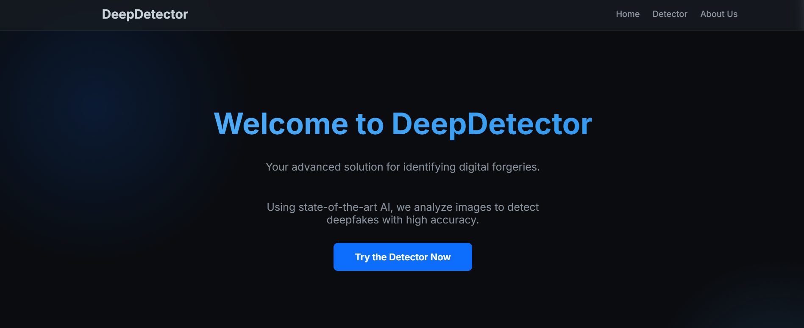
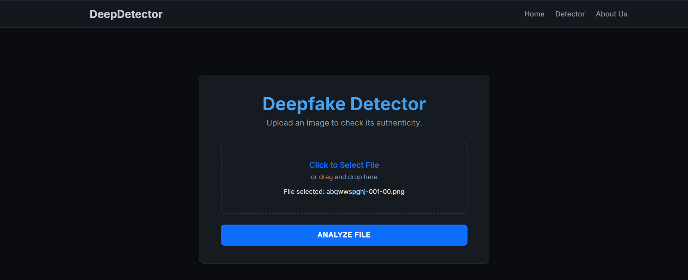
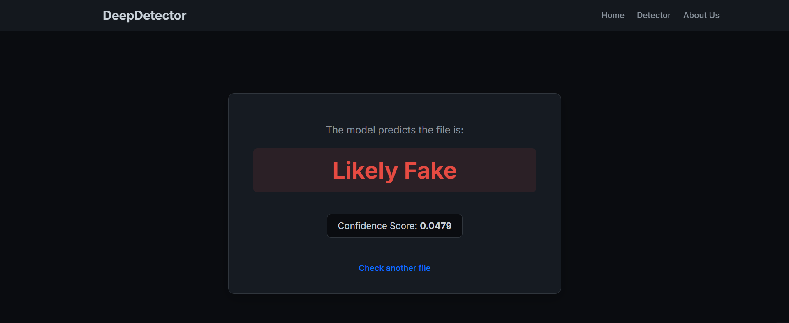

# 🤖 DeepDetector: A Deepfake Detection Web App

This project is a multi-page web application built with Django that leverages a trained **ResNet (Convolutional Neural Network)** to detect deepfake images. It provides a clean, modern, and user-friendly interface for uploading an image to receive an instant prediction on its authenticity.

This project was built by **Shravya N.** and her teammates from **Jyothy Institute of Technology, Bengaluru**.

---

## 📸 Screenshots

| Homepage | Detector (Uploader) | Results Page |
| :---: | :---: | :---: |
|  |  |  |
| *The main landing page with an animated background.* | *The file uploader with a "click to select" interface.* | *The final prediction and confidence score.* |

---

## ✨ Features

* **Full Multi-Page Website:** A complete site with a **Homepage**, **Detector**, and **About Us** page.
* **AI-Powered Detection:** Uses a trained Keras/TensorFlow model (`best_model.h5`) to analyze images in real-time.
* **Modern UI/UX:** A "fancy" dark-mode interface with a fixed navigation bar, glowing effects, and a custom loading spinner.
* **Clear Feedback:** Provides a clear, human-readable prediction (e.g., "Likely Fake," "Definitely Real") along with the raw confidence score.
* **Clean Django Backend:** Uses a standard Django structure to serve pages and handle the ML model logic.

---

## 💻 Tech Stack

* **Backend:** Python, Django
* **Machine Learning:** TensorFlow, Keras, NumPy
* **Frontend:** HTML5, CSS3, JavaScript
* **Image Processing:** Pillow (a fork of PIL)

---

## 🚀 Installation and Setup

Follow these steps to get the project running on your local machine.

### 1. Prerequisites

* Python 3.9+
* `pip` (Python package installer)

### 2. Clone the Repository

```bash
git clone [https://github.com/your-username/your-repo-name.git](https://github.com/your-username/your-repo-name.git)
cd deepfake_project
